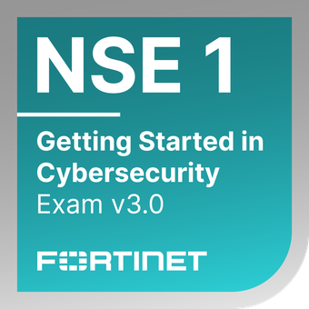
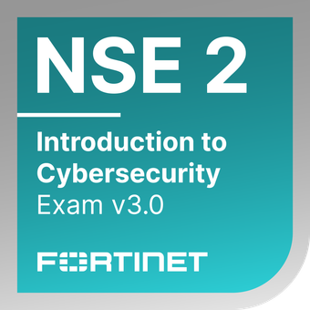

# João Pedro Duarte de Souza  
### Blue Team | SOC & CSIRT | Cybersecurity Operations

Cybersecurity-focused Computer Science student with a clear professional direction toward **Blue Team operations**, **SOC monitoring**, and **CSIRT activities**.

My background combines strong **defensive security fundamentals**, vendor-oriented cybersecurity training, and **offensive security knowledge applied strictly to improve detection, response, and resilience**.

---

## 🏆 Certifications & Badges

  
  
  
  
  
  
  
  

### Certifications & Professional Training (ATS-friendly)
- Fortinet Certified Associate Cybersecurity  
- Fortinet Certified Fundamentals Cybersecurity  
- Fortinet FortiGate 7.6 Operator  
- Fortinet NSE 1 – Getting Started in Cybersecurity  
- Fortinet NSE 1 – Introduction to the Threat Landscape  
- Fortinet NSE 2 – Technical Introduction to Cybersecurity  
- Cisco Introduction to Cybersecurity  
- **Pentester Associate – IBSEC** *(offensive fundamentals applied to defense)*  
- **Introduction to Pentesting – DESEC Security** *(hands-on offensive security foundations)*  

---

## 🛡️ Core Focus Areas (Blue Team)

- Security Operations Center (SOC)
- Security monitoring and alert triage
- Log analysis and correlation
- Incident identification and escalation
- CSIRT workflows and incident response lifecycle
- Threat awareness and attacker behavior analysis

---

## 🧠 Technical Foundations

### Defensive Security
- Incident response lifecycle (identify, contain, eradicate, recover)
- SOC operational workflows
- Detection-oriented security mindset

### Networking & Systems
- TCP/IP and OSI model
- Network traffic analysis fundamentals
- Operating systems fundamentals

### Tools & Exposure
- SIEM concepts
- Wireshark
- Nmap (defensive usage)
- Burp Suite (analysis perspective)
- Security labs and simulated environments

---

## 🚀 Career Objective

To work as a **SOC Analyst / Blue Team Analyst**, contributing to **incident response, monitoring, and continuous security improvement**, with a long-term goal of operating within **CSIRT teams** in mature security environments.

---

## 📫 Contact
- LinkedIn: https://www.linkedin.com/in/jpdsoc
